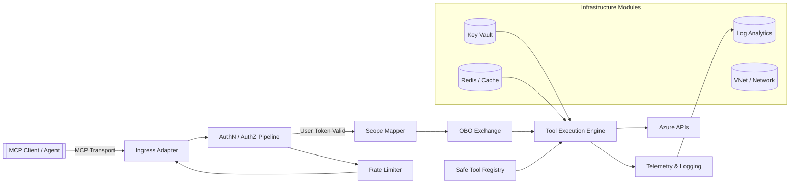
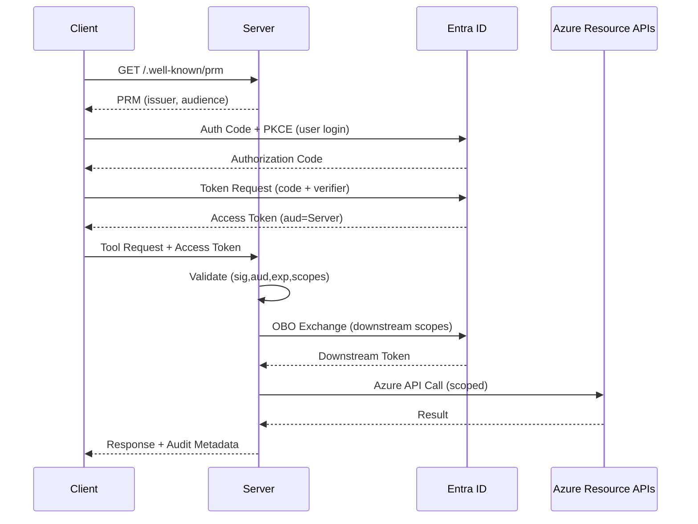
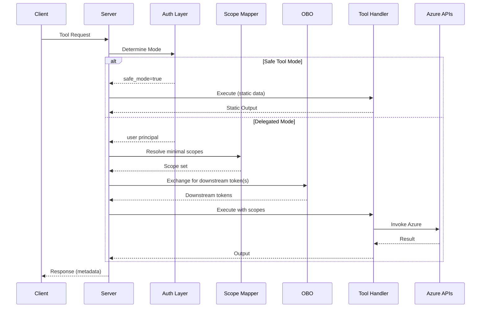
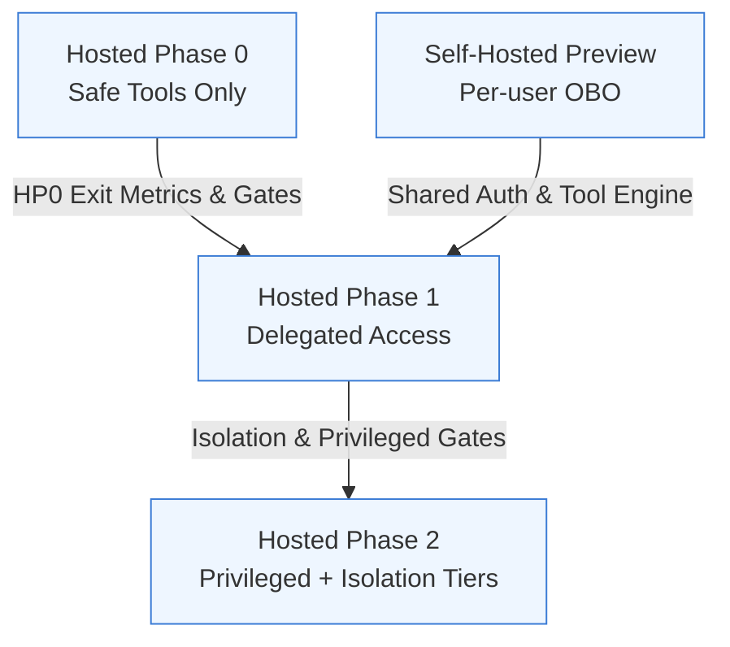
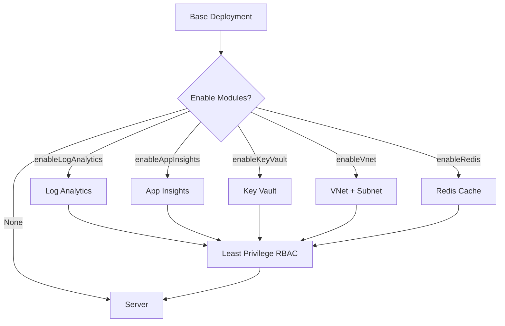

<!--
	Azure MCP Server Hosting Specification
	Status: Draft (Targeting Remote Preview)
-->

# Azure MCP Server Hosting Specification

## 0. Document Metadata
| Field | Value |
|-------|-------|
| Title | Azure MCP Server Hosting Specification |
| Version | 0.5-draft |
| Status | Draft (for internal review) |
| Owners | TBD |
| Last Updated | 2025-08-19 (Microsoft-hosted model integrated; Sections 24/25 promoted to normative Phase 0 for hosted) |
| Target Milestone | Remote Preview |

All normative requirements use RFC 2119 keywords (MUST, SHOULD, MAY, MUST NOT, SHOULD NOT).

### Executive Summary
**One unified blueprint** to run the Azure MCP Server in Azure: immediately safe for customer self‑hosting and deliberately low risk when Microsoft hosts it. The design ties every real Azure action to an authenticated user, constrains privilege to only what each tool declares, and adds capability in controlled phases. We start with a strictly static, non‑tenant‑aware “safe” tool subset (no live calls into customer Azure, no secrets, no subscription or resource IDs), add delegated read access only after security gates pass, then introduce isolated write tiers. **No hidden elevation paths. No speculative features before controls.**


**Core Proposal**
| Aspect | Summary | Value | Guardrails |
|--------|---------|-------|------------|
| Self‑Hosted Baseline | All real Azure calls use per‑user delegated tokens (Auth Code + PKCE + OBO) from day one | Immediate productive use with precise RBAC & audit fidelity | MI restricted to infra support (secrets, logging) only; no privilege aggregation |
| Hosted Phase 0 | Public endpoint offers only static, pre‑vetted safe tools; zero interaction with customer Azure resources | Enables early ecosystem integration with negligible customer risk | Prominent labeling, telemetry, strict allowlist, hard rate limits |
| Phase Progression | Read (Phase 1) then constrained write (Phase 2) added only after explicit security & reliability gates | Predictable risk escalation; stakeholders see measurable readiness before capability expands | Exit metrics + rollback objective (<15 min) + mandatory scope minimization tests |
| Unified Specification | Single doc covers self‑host + hosted; conditional exposure instead of forked designs | Eliminates drift, duplicated reviews, inconsistent guidance | Any change merges once; phase gating controls runtime activation, not content divergence |

**Problem Statement**: Existing ad hoc hosting paths trade off velocity and security (broad Managed Identity roles, privilege expansion, speculative features). This design replaces that with per‑request least‑privilege delegation, explicit phase gates, and a static safe surface for early hosted discovery.

**Strategic Guarantees**
1. No Azure resource access occurs without an authenticated user principal (except static safe subset).  
2. Every operation’s required scopes are declared up front and validated; over‑broad requests are rejected.  
3. Advancing a hosted phase never removes an existing control (monotonic security).  
4. Rollback from any new capability to the prior phase target is operational in <15 minutes (artifact + config only; no data migration).  
5. MI role set remains constant across phases (infra-only), preventing silent privilege creep.

**Rationale**: Enables immediate self‑hosted use while establishing measurable gates for hosted expansion, reducing tension between rapid delivery and required controls.

**Key ideas 🧩**
* ⚙️ Stateless Implementation: Although the MCP protocol defines conversational / session semantics, our server treats each request independently (no server-held workflow/session state) so any replica can handle any request.
* 🎯 Declarative scopes: Each tool declares only the minimal Azure scopes it needs (or marks itself static); broader requests are rejected.
* 🛑 Fail‑fast startup: Missing required auth configuration halts the server (unless explicitly in safe mode).
* 🧱 Tiered model: Safe (static), Guarded (read), Privileged (write). Only Safe runs without auth.
* 🔌 Modular infra: Add logging, tracing, network isolation, cache, Key Vault only when needed.

**Tracks 🗺️**
1. Self‑Hosted (single tenant): full per‑user delegated calls now.
2. Hosted: Phase 0 safe tools only; later phases add delegated access, isolation, and privileged operations.

**Security at a glance 🔐**
* ❌ No MI shortcut for user actions.
* 🔄 Per‑user tokens validated then exchanged (OBO) for exact downstream scopes.
* 📜 Rate limiting + logging from day zero; PoP / stronger token binding evaluated later.
* 🪧 Safe mode clearly labeled to prevent mistaken Azure interaction assumptions.

**Success indicators 📊**
* ✅ <1% unauthorized attempts succeed.
* 🚀 P95 latency <2s (delegated) / <1.2s (safe tools).
* 🔁 Risky feature rollback <15 minutes.

**Headline risks & mitigations ⚠️**
| Risk | Simple Mitigation |
|------|------------------|
| Shared public client misuse | Monitor telemetry; encourage vendor-specific client IDs |
| Token replay | Enforce TLS; short lifetimes; plan for PoP later |
| Managed Identity overreach | MI barred from user authorization paths |
| Users misreading safe mode | Banners + response metadata + docs disclaimers |
| Incorrect tool scope mapping | Test: declared vs actual Azure calls |
| Future cross-tenant leakage | Design isolation seams early (process/container tiers) |

**Out of scope (this draft) 🚫** Billing, multi‑region SLA, sovereign cloud rollout, dynamic client registration, collaborative session state, deep compliance mapping.

**Outcome ✅** One design that secures self‑hosted usage immediately and allows safe hosted expansion, adding capability only after explicit security gates are met.

### Visual Overview (Diagrams)
The following mermaid diagrams supplement the specification. They are illustrative – normative text prevails if discrepancies arise.

#### Figure 1. System Architecture (Core Components & Data Flow)


#### Figure 2. Authorization Code + PKCE + OBO Sequence


#### Figure 3. Tool Invocation Flow (Safe Mode vs Delegated)


#### Figure 4. Hosted Phasing & Gates


#### Figure 5. Infrastructure Module Enablement


Diagram Notes:
* Scope Mapper only invoked for delegated (non-safe) tool requests.
* Hosted Phase 0 omits OBO and Azure API branches entirely (Figure 3 safe path only).
* Infrastructure modules are orthogonal; absence defaults to minimal footprint.


## 1. Scope
Included:
* Running the Azure MCP Server in Azure (self‑hosted and Microsoft‑hosted models).
* Identity & authorization flows (user → server → Azure APIs) plus safe unauthenticated mode boundaries.
* Deployment targets, configuration, security baselines, rollout gating.

Coverage labels:
* Self‑Hosted – Fully specified with mandatory per‑user delegated access.
* Hosted – Phase 0 (safe tools only) is normative; later phases (delegated access, isolation tiers) remain descriptive pending approval.

Excluded (this draft): Billing, premium isolation SKUs, sovereign cloud schedules, full compliance certification roadmap.

## 2. Goals & Non‑Goals

### 2.1 Goals
1. Deliver a secure, low‑ops Azure hosting path.
2. Enforce per‑user delegated access for all real Azure calls.
3. Restrict Managed Identity to infrastructure only (never a user auth substitute).
4. Gate experimental transports behind explicit flags and warnings.
5. Remain stateless; introduce isolation layers only when justified.
6. Provide clear defaults for logging, rate limiting, identity, and networking.
7. Supply least‑privilege role guidance and hosted isolation principles.
8. Allow selective enablement of infrastructure modules.
9. Provide a clearly labeled safe‑tool mode with zero customer tenant access.
10. Maintain a single converged specification (avoid drift).

### 2.2 Non-Goals
1. Delegated access in the initial safe‑tool only mode.
2. Exhaustive coverage of all Azure compute platforms (focus on primary targets first).
3. Complex shared session or collaboration features.
4. Exhaustive non‑Azure hardening guidance.
5. Dynamic client registration (pending platform capability).
6. Billing or chargeback (metrics only for potential future use).

## 3. Definitions
| Term | Definition |
|------|------------|
| MCP | Model Context Protocol. |
| PRM Document | Protected Resource Metadata ([RFC 9728](https://datatracker.ietf.org/doc/rfc9728/)). Retrieved prior to initiating any user authorization flow; conveys auth discovery hints & accepted audiences. |
| MI | Managed Identity (system or user-assigned) in Azure. |
| OBO | OAuth 2.0 On-Behalf-Of flow for delegated downstream API access. |
| Demo Mode | Unauthenticated, strictly static, read-only operational mode for UX validation. |
| Streamable HTTP | Emerging HTTP-based transport with chunked/streamed responses (experimental). |

## 4. Azure Hosting / Compute Options

| Option | Primary Use Case | Pros | Cons / Risks | Managed Identity | Scale Model | Startup Latency | Networking / Ingress | Cost Profile |
|--------|------------------|------|--------------|------------------|-------------|-----------------|----------------------|--------------|
| **Azure Container Apps (ACA)** | Default recommended preview target | Simple deployment, DAPR option, revisions/blue‑green, built-in autoscale (HTTP, KEDA), secrets, MI support | Cold start (smaller revisions), streaming limits to validate, per‑app concurrency tuning needed | Yes | Horizontal w/ KEDA | Low‑Med | Env, custom domains, internal ingress | Consumption-ish (pay per vCPU/sec) |
| **Azure App Service (Linux Container)** | Traditional web workloads, enterprise familiarity | Mature platform, built-in auth integration, easy diagnostics, slots | Less granular scaling vs ACA, container memory limits, streaming perf to test | Yes | Instance scale out | Med | Built-in WAF/AppGW integration | Steady cost per instance |
| **Azure Kubernetes Service (AKS)** | Advanced customers needing custom networking or sidecars | Full control, can co-host additional infra (Redis, vector DB) | Operational overhead, cluster cost baseline, upgrade mgmt | Yes (pod MI / workload identity) | HPA/KEDA | Depends on node pool | Full Kubernetes ingress stack | Higher; node baseline |
| **Azure Functions (Container / .NET isolated)** | Event-driven, sporadic usage | Elastic scale, native identity, binding ecosystem | Durable streaming session semantics harder, cold start, execution time limits, local dev divergence | Yes | Per-function elastic | Potential cold start | HTTP trigger + APIM optional | Consumption (burst friendly) |
| **Azure Container Instances (ACI)** | Ephemeral dev / test | Fast spin-up, no orchestration overhead | Not ideal for always-on, limited autoscale, ephemeral networking complexity | Yes | Manual / scripted | Low | Basic; private vNet optional | Per-second ephemeral |
| **Azure VM Scale Sets** | Edge cases needing custom OS / long-running state | Full control, custom images | Highest ops burden, patching, scaling logic custom | Yes | Custom | Depends on image | Fully custom (NSG, LB) | Pay for full VM uptime |
| **Azure Spring Apps / Others** | Niche, Java-centric | Platform features for JVM | Not aligned with core target languages initially | Yes | Platform scale | Med | Standard ingress | Specialized pricing |

### 4.1 Prioritization (Preview)
| Tier | Targets | Rationale |
|------|---------|-----------|
| 1 | Azure Container Apps (primary), Azure App Service | Low operational overhead, MI support, rapid rollout |
| 2 | AKS, Azure Functions (HTTP subset) | Advanced control (AKS) / burst (Functions); higher complexity |
| 3 | ACI (dev), VMSS, others | Specialized / legacy or higher ops burden |

The implementation MUST initially deliver Tier 1. Tier 2 MAY be documented. Tier 3 MUST NOT block preview.

## 5. Deployment Artifacts & Packaging
| Artifact | Purpose | Required for Preview? | Notes |
|----------|---------|-----------------------|-------|
| Container Image (`mcr.microsoft.com/azure-sdk/azure-mcp`) | Primary deployment unit | Yes | Must publish versioned & `:latest` tags. Consider slim image variant. |
| Bicep / azd template | Turnkey infra + app | Yes | Provide `infra/` example with ACA + Log Analytics + MI assignment. |
| Helm Chart (AKS) | Optional advanced path | No (Doc only) | Provide later; ensure OPA/gatekeeper disclaimers. |
| GitHub Actions & Azure DevOps snippets | CI/CD guidance | Yes | Show build, scan, push, deploy. |
| `az containerapp up` quickstart | Fast start | Yes | Lean path for POC. |

### 5.1 Infrastructure Modularity & Selective Resource Enablement
Infrastructure add‑ons MUST be opt‑in. Templates MUST provision only components explicitly enabled by parameters or flags; the default (all disabled) MUST still yield a functional server. This section defines the pattern—NOT an exhaustive module catalog—to avoid implying a closed set of integrations.

Pattern (Normative):
1. Boolean (or equivalent) enable switch per module (e.g., `param enable<KeyVault> bool = false`).
2. No resource deployment when disabled (no placeholder stubs).
3. Least‑privilege role assignments emitted only when enabled.
4. Outputs (endpoints, IDs) clearly optional; callers handle absence gracefully.
5. Documentation entry per module: purpose, minimal roles, principals granted, security & cost notes, rollback procedure.
6. New module PR MUST include a threat note (attack surface deltas) and RBAC diff.
7. Hidden coupling is forbidden: enabling one module MUST NOT silently enable another; unmet dependency MUST fail fast with a clear error.
8. Tool exposure MAY be conditional on backing module presence (e.g., advanced logging query tool only if logging enabled).

RBAC Guidance:
* Prefer resource‑scoped over subscription‑wide roles.
* Treat granting broad Reader merely to “unblock” as a defect; fix scope mapping.
* Startup SHOULD warn if Managed Identity gains roles outside documented minimal sets.

Illustrative Examples (Non‑Exhaustive):
* Logging (`enableLogging`): create workspace only when requested; assign MI Reader on that workspace.
* Secrets (`enableKeyVault`): create vault; grant MI `Key Vault Secrets User`; avoid broad certificate/key roles if unused.
* Network (`enableVnet`): create VNet/subnet; modules requiring private endpoints validate its presence.

Environment Flags (Examples Only): `AZURE_MCP_ENABLE_KEY_VAULT`, `AZURE_MCP_ENABLE_LOGGING`, `AZURE_MCP_ENABLE_CACHE`.

Open Considerations:
* Automated dependency validation (e.g., private DNS without VNet → fail fast).
* Dynamic tool surface adaptation.
* Optional cost appendix with example monthly estimates per module.

Security Rationale: Opt‑in modularity reduces attack surface, RBAC footprint, and operational cost by avoiding unnecessary services and secrets.

## 6. Authentication & Authorization Model

### 6.1 Server → Azure
Uses Azure Identity with Managed Identity when running inside Azure. Fallback to existing credential chain for local dev. The environment variable to enable production credentials (`AZURE_MCP_INCLUDE_PRODUCTION_CREDENTIALS=true`) remains valid.

### 6.2 End User → Server (Remote Mode)
Steps (non‑demo mode):
1. Client acquires a user access token (Auth Code + PKCE preferred; Device Code fallback) for the server audience.
2. Client sends the token with each request.
3. Server validates it (issuer, signature, audience, expiry, scopes/roles, tenant) and builds principal context.
4. Server performs OBO exchange for the minimal downstream Azure scopes declared by the tool.
5. Authorization = user claims ∩ tool‑declared scopes ∩ policy overlays.
6. Tool executes with the OBO token(s); logs record user identity (OID/tenant) and effective scopes.

Managed Identity MUST NOT substitute for user authorization. It MAY support only infrastructure tasks (e.g., reading a config secret) after user validation.
Fail‑fast: If required auth configuration (app registration / audience) is missing, startup MUST fail (unless safe/demo mode is explicitly enabled) and MUST emit a clear message listing required settings.

### 6.3 Token Exchange / Flow Considerations
| Concern | Mandatory OBO Flow |
|---------|-------------------|
| Per-user auditing | Strong (distinct principal) |
| Complexity | Higher (accepted trade-off) |
| Attack surface (token replay) | Mitigated via TLS, audience validation, short lifetimes |
| RBAC fidelity | Exact / least privilege |

### 6.4 Local Development Requirements
The local server MUST NOT expose unauthenticated public endpoints. The following controls are REQUIRED:
1. MUST bind to `127.0.0.1` (loopback) by default.
2. MUST require an explicit opt-in flag to listen on any non-loopback interface (e.g., `--listen-any`), and MUST display a critical warning when used.
3. Streamable HTTP transport: **NOT SUPPORTED** in local mode for the initial remote preview (hard disabled; no override flags or environment variables to re-enable).
4. Demo mode (if present) MUST refuse streamable HTTP (implicit by #3).
5. MUST emit a high-visibility banner (stderr) on startup summarizing: bind address, enabled transports, auth mode, demo mode status.
6. SHOULD periodically (e.g., every 15 minutes) log a security heartbeat summarizing the same (to aid forensic review).

### 6.5 Managed Identity Scope Strategy
* MI is NEVER used to satisfy end-user requests to enumerate or query arbitrary resource groups; those operations MUST use the user’s delegated (OBO) token.
* Scope MI only for infrastructure/support needs (e.g., reading config secrets, emitting logs, accessing an internal artifact store) – not for broad ARM read.
* Prefer narrowly scoped data-plane or secret-access roles (Key Vault Secrets User on a specific vault, Storage Blob Data Reader on an internal container) instead of subscription- or tenant-wide Reader.
* Avoid giving MI Reader at subscription just to “make things work”; if code requires that, treat it as a bug and tighten tool→scope logic for user delegation.
* Escalate MI roles only when a concrete infra capability (e.g., writing to a diagnostics storage account) cannot be achieved by existing minimal roles; document justification and rollback path.
* Periodically audit MI role assignments; drift (new broad roles) SHOULD trigger a warning at startup.
* Hosted multi-tenant scenario consideration: the baseline path SHOULD be pure per-user OBO with **no** customer subscription RBAC grants to a Microsoft-controlled MI. MI (if present) MUST be limited to platform-internal resources (e.g., a logging workspace owned by the service team) and MUST NOT rely on or request access to customer subscriptions.

**Clarification – “Infrastructure / Support Only”**
Infrastructure-only means the Managed Identity is restricted to operating the service itself (its own configuration, secrets, telemetry, or delivery pipeline) and is never a proxy for customer Azure resource access. Concretely, the MI MAY: (a) read a Key Vault secret containing a signing key for protocol metadata, (b) write structured logs or metrics to a Log Analytics workspace the service team owns, (c) pull an internal container image or blob artifact required at runtime. It MUST NOT: (a) enumerate or read customer subscriptions / resource groups, (b) list or inspect customer storage accounts, (c) fetch diagnostic settings from arbitrary customer resources, (d) perform any data-plane read/write on customer assets. Any operation whose success semantics depend on the customer’s RBAC assignments MUST flow through a per-user delegated (OBO) token so audit logs reflect the actual human principal.

**Concrete Example**
User invokes a tool to list storage accounts in subscription S. Flow:
1. Tool declares required action `Microsoft.Storage/storageAccounts/read`.
2. Server attempts with user’s delegated token (OBO) → Entra issues downstream ARM token scoped to user principal.
3. If access denied (user lacks role), server returns structured authorization failure hint (Section 6.10) specifying minimal role (e.g., `Reader` at subscription or `Storage Account Contributor` at resource group) WITHOUT falling back to MI.
4. Managed Identity is not consulted because doing so would return results the user is not permitted to view, violating least privilege and audit fidelity.

If the server needs to retrieve a configuration blob `mcp-config.json` from its internal storage account (unrelated to customer subscription S), it may use the MI assigned role `Storage Blob Data Reader` scoped ONLY to that internal storage account. This action never surfaces customer data and does not aid privilege escalation into customer scopes.

Rationale: End users may query any resource group. Granting MI wide read access would collapse least‑privilege boundaries and create an attractive escalation target. Using per-user delegated tokens preserves precise RBAC and audit trails per operation.

### 6.6 Future: Per-user Delegation
* Evaluate OAuth 2.0 OBO with confidential app (App Registration + audience validation).
* Consider Proof-of-Possession (TLS-bound tokens) if MCP spec adds channel binding.

### 6.7 Unauthenticated Read-Only Demo Mode
Purpose: quick visual / UX validation without touching customer Azure data. MUST remain tightly limited.

| Aspect | Draft Approach |
|--------|----------------|
| Purpose | Fast preview of remote transport + UX without completing auth/OBO design. |
| Enable Mechanism | Explicit flag `--enable-demo-mode` OR env `AZURE_MCP_ENABLE_DEMO_MODE=true`; NEVER default. |
| Tool Surface | Extremely limited, whitelisted safe operations returning static / synthetic data only. No subscription / tenant enumeration. |
| Data Sources | Prefer baked-in static JSON snapshots (e.g., example storage account schema, generic RBAC role list) to avoid hitting real Azure APIs without auth. |
| Branding | Responses clearly include `"mode": "demo"` field and warning banner on server start + first N responses. |
| Security Controls | Hard rate limit (e.g., 30 req/min/IP), no write/destructive commands, no network egress except telemetry (respect opt-out). |
| Telemetry | Emit `demo_mode_enabled` event (anonymized). Track tool usage to refine safe set. |
| Abuse Mitigation | Auto-shutdown after configurable idle period (e.g., 30 minutes). Optional CAPTCHA / signed nonce for public endpoints (defer). |
| Sunset Plan | Marked experimental; removed or replaced once authenticated remote mode reaches stability. |
| Documentation | Prominent disclaimer: "Demo mode does NOT access your Azure resources; outputs are illustrative only." |

"Safe" candidate commands (illustrative; subject to review):
* Bicep schema lookup (served from embedded manifest, not live ARM call).
* Best practices guidance (static text file resource already present).
* Tool listing / capabilities (subset) for UI validation.

NOT allowed in demo mode (initial):
* Any command requiring subscription, resource group, or tenant parameters.
* Commands with network calls to Azure management/data plane.
* Destructive or mutation operations.

Implementation Sketch:
1. Add mode detector early in startup; when active, replace tool registry with curated static tool set.
2. Inject a response decorator adding demo warning metadata.
3. Block any attempt to pass subscription/resource parameters (validation layer).
4. Enforce rate limiting middleware (in-process token bucket) scoped to remote transport only.
5. Auto-disable if an auth credential becomes available (optional; could prompt to restart in full mode).

Risk Considerations:
* Users may believe they are interacting with real Azure resources. → Mitigation: explicit labeling, banner, distinct tool names (e.g., `demo-storage-example-list`).
* Attackers could scrape static data for amplification. → Mitigation: minimal static set, rate limiting.
* Accidental production enablement. → Mitigation: require BOTH flag and env var (defense in depth) OR build-time compile symbol for distribution images.

### 6.8 Ideal Entra ID (Authorization Code + PKCE + OBO) Flow & Gaps
Target future architecture for per-user delegated access:

**Target Sequence**
1. MCP server advertises (in its Protocol Registration / PRM document) that it uses Microsoft Entra ID for auth (includes issuer / audience metadata pointers or discovery hints).
2. Client connects to MCP server and retrieves the PRM document.
3. Client discovers Entra as the Authorization Server (AS) from PRM metadata.
4. Client constructs Entra OpenID Connect / OAuth2 metadata URLs (well-known discovery) and fetches endpoints.
5. Client registers with the Authorization Server (dynamic client registration) OR already possesses a suitable client ID.
6. Client initiates Authorization Code Flow with PKCE directly against Entra (user authenticates + consents).
7. Entra issues an access token whose `aud` (audience) is the MCP server (plus optional ID token for client state).
8. Client sends that access token to the MCP server on each request (e.g., Bearer token header / agreed channel field).
9. MCP server validates token (issuer, signature, expiry, audience, scopes / roles, nonce / c_hash as needed).
10. MCP server performs OAuth 2.0 On-Behalf-Of (OBO) flow to exchange the user token for downstream resource tokens (ARM, Storage, etc.).
11. MCP server maps/associates downstream tokens to the inbound user principal (cache keyed by user object ID + scopes) and executes tool operations.
12. Responses returned; auditing & telemetry capture per-user context.

**Current Blocking Gap**: No dynamic client registration for arbitrary third-party native MCP clients.

**Interim Alternatives**
| Approach | Description | Pros | Cons / Risks |
|----------|-------------|------|--------------|
| Pre-registered multi-tenant Public Client | Publish a client ID (no secret) that all MCP clients can use for auth code + PKCE | Simple for ecosystem, no secret distribution | Hard to apply client-specific policies, revocation affects all, potential misuse rate limits |
| Per-vendor Client IDs (manual registration) | Each MCP client vendor maintains an Entra app registration | Stronger isolation/accountability | Friction for new clients; coordination overhead |
| Device Code Flow (interactive fallback) | Clients invoke device code to let user authenticate in browser | Works without embedded browser, simpler UX for CLIs | Less seamless, slower, not ideal for high-frequency re-auth scenarios |
| Managed Identity Only (DISALLOWED for remote production) | No per-user token; server uses MI for downstream calls | Simplicity (theoretical) | Eliminates per-user RBAC & auditing; aggregated privilege; not permitted |
| Brokered Auth (VS Code / WAM) | Leverage existing signed-in account in host environment | Smooth UX for first-party tools | Not portable to arbitrary MCP clients |
| Central Host-Managed Per-Client Registrations (REJECTED) | Platform centrally creates distinct app registrations & redirect URIs | Superficial onboarding simplicity | Governance/security risk (sprawl), broad revocation impact, higher operational overhead |

Per-user OBO is required for precise RBAC enforcement and auditability. MI-only mode is disallowed for remote production usage to avoid aggregated privilege under a single principal.

**Mandatory Mitigations (Enforced)**
1. Fail-fast startup if required app registration / audience not configured (unless Demo Mode explicitly enabled).
2. Tool → scope map drives minimal downstream scope requests (no broad wildcard resource scopes).
3. Principal context (auth_mode, user_oid, tenant_id, scopes, correlation_id) logged for every request.
4. Optional shared multi-tenant public client ID usage MUST emit telemetry for anomaly detection; per-vendor registration strongly recommended.
5. Managed Identity privileged operations MUST be gated by explicit code path requiring an already-authenticated user principal.

**Design Considerations (Future OBO)**
* Token Validation: Cache JWKS, enforce clock skew tolerance, validate `tid`, `iss`, `aud`, `exp`, `nbf`, `scp`/`roles`.
* OBO Caching: Key by (user_oid, tenant_id, resource, scope set) with TTL shorter than underlying token expiry; handle `invalid_grant` and `interaction_required` retries gracefully.
* Downstream Scope Minimization: Map tool → required resource scopes; request minimal union per operation.
* Privacy: Avoid persisting raw tokens; store only hashes / expiry for correlation; support explicit purge.
* Revocation Handling: Consider short token lifetimes + proactive refresh vs heavy introspection (Entra introspection limited).

**Risks**
| Risk | Impact | Mitigation Candidate |
|------|--------|----------------------|
| Public client ID abuse | Rate limiting / reputational blocking | Publish usage guidance + telemetry anomaly detection |
| Token replay (no PoP) | Unauthorized downstream calls if stolen | Evaluate channel binding when MCP spec supports PoP; enforce TLS; minimize token lifetime |
| Scope creep in MI fallback | Privilege escalation | Ship RBAC least-privilege templates; warn if broad roles detected |
| Mixed-mode complexity | Maintenance overhead | Clear capability negotiation; versioned auth block in PRM |

**Decision Gates (Satisfied / Required For Remote Mode)**
| Gate | Description | Required Evidence |
|------|-------------|-------------------|
| G1 | Entra DCR available OR approved fallback model | DCR public preview OR security sign-off for shared public client |
| G2 | Principal context logging ready | Structured logs include user_oid, tenant_id (hashed), scopes |
| G3 | Token handling hardening complete | JWKS cache, audience validation tests, clock skew tests, secret scans clean |
| G4 | Rate limiting & abuse detection in place | Per-user throttle + anomaly queries published |
| G5 | Threat model updated | Reviewed with security; mitigation owners assigned |

**Short-Term Directive**: OBO per-user delegation REQUIRED; remote startup MUST fail if any gate is unsatisfied.

#### Principal Context Resolution
| Mode | Inbound Credential | Effective Principal | Mapping Logic |
|------|--------------------|---------------------|--------------|
| OBO | User access token (`aud`=server) | User OID + tenant + downstream tokens | Validate token → extract {oid, tid, scopes} → cache minimal-scope downstream tokens |
| Demo Mode | None | Synthetic anonymous principal | Restricted tool registry; log `auth_mode=demo` |

**Operational Mandate**: Remote mode MUST NOT activate without validated per-user authentication (except Demo Mode safe set).

### 6.9 Authentication Option Evaluation & Justification
This subsection enumerates potential authentication patterns and formally ACCEPTS or REJECTS them with rationale. Accepted items define the supported matrix; rejected items MUST NOT be reintroduced without a security review.

| Option | Decision | Justification | Key Risks (if accepted) | Mitigations / Notes |
|--------|----------|---------------|-------------------------|---------------------|
| Authorization Code + PKCE + OBO (per-user delegated) | ACCEPT | Precise RBAC, auditability, least privilege | Token replay (bearer) | TLS, short lifetimes, future PoP evaluation |
| Device Code Flow (fallback) | ACCEPT (fallback only) | Works for CLI / no embedded browser | Slower UX; user confusion if overused | Limit docs placement; prefer Auth Code where possible |
| Managed Identity ONLY (no per-user tokens) | REJECT | No per-user RBAC, aggregated privilege | N/A | Disallowed; MI infra-only (6.5) |
| MI + Broad Reader as user surrogate | REJECT | Violates least privilege; audit loss | Privilege escalation | Use OBO instead |
| Public multi-tenant client ID (shared) | CONDITIONAL | Lowers onboarding friction | Abuse / throttling | Telemetry & anomaly detection; recommend per-vendor IDs |
| Per-vendor app registrations | ACCEPT | Isolation & revocation scope | Onboarding friction | Provide doc automation; templates |
| Brokered Auth (e.g., WAM / VS Code integration) | ACCEPT (adjunct) | Great UX for first-party shells | Not universal | Treated as token acquisition layer feeding OBO |
| OAuth Client Credentials (app-only) for user operations | REJECT | Loses user identity & RBAC fidelity | Hidden over-priv | Keep only for internal service-to-service if ever needed |
| API Keys / Static Secrets | REJECT | No user identity / rotation burden | Leakage, replay | Not implemented |
| PAT / Personal Tokens | REJECT | Non-standard for Azure resource RBAC | Scope misalignment | Not supported |
| Dynamic Client Registration (DCR) | DEFER | Platform gap today | N/A | Revisit when Entra supports secure native DCR |
| Proof-of-Possession (channel bound tokens) | FUTURE | Strong replay mitigation | Complexity / ecosystem support | Track MCP & Entra roadmap |
| mTLS Client Cert Mapping | FUTURE (investigate) | Strong binding, mutual auth | Client cert provisioning complexity | Optional additive layer later |

Normative Outcomes:
1. Only per-user delegated flows (Auth Code + PKCE + OBO; Device Code fallback) MAY authorize end-user Azure operations.
2. Managed Identity MUST remain infrastructure-only; it MUST NOT fulfill or broaden user delegation gaps.
3. Client Credentials, API keys, static secrets, PATs MUST NOT be used for end-user initiated Azure resource operations.
4. Shared public client ID usage (if provided) MUST emit telemetry and MAY be rate limited more aggressively.
5. Any future adoption of PoP or mTLS MUST preserve existing OBO semantics and not bypass per-user principal construction.

### 6.10 Authorization Failure Role Guidance (User Feedback)
When a tool invocation fails due to insufficient Azure permissions (authorization failure after successful authentication), the server SHOULD help the user (and operator) remediate by indicating the minimal roles or actions required. This feedback MUST avoid over-disclosure (no full internal policy dump) while being actionable.

Normative Requirements:
1. The tool metadata MUST declare the minimal Azure permissions (expressed as scope → required role set or specific action list) it expects.
2. On an authorization failure, the server SHOULD return a structured error payload containing: an error code (e.g., `authorization_denied`), the specific missing actions or roles, and a short remediation hint ("Assign Role X at scope Y").
3. The server MUST NOT suggest overly broad roles when a narrower role satisfies the requirement (e.g., suggest `Storage Blob Data Reader` instead of `Reader` if only blob read is needed).
4. If multiple roles satisfy the missing actions, the response SHOULD include the smallest set ranked by least privilege.
5. The response MUST omit tenant IDs or resource IDs the user is not already authorized to view.
6. A telemetry event (authorization_failure_hint_emitted) SHOULD log anonymized counts to improve guidance quality; no raw tokens or PII.
7. Tool authors MUST treat discrepancies between declared minimal permissions and actual downstream calls as a defect; automated tests SHOULD assert parity (see Issue I7).

Illustrative Error Payload (example):
```json
{
	"error": "authorization_denied",
	"tool": "storage-account-list",
	"missing": {
		"actions": ["Microsoft.Storage/storageAccounts/read"],
		"suggestedRoles": [
			{"name": "Storage Blob Data Reader", "scopeType": "resourceGroup"}
		]
	},
	"remediation": "Ask your administrator to assign the 'Storage Blob Data Reader' role at the target resource group scope and retry.",
	"correlationId": "<guid>"
}
```

Open Considerations:
* Localized role display names vs internal action lists.
* Caching of role resolution metadata for performance vs drift risk.
* Operator override to suppress hints in high-security environments.

## 7. Protocol & Transport Strategy

### 7.1 Current Protocols
* MCP standard request/response over stdio / local transports.
* Streamable HTTP (emerging) – flagged as experimental; security review pending.

### 7.2 Streamable HTTP Policy (Preview)
| Aspect | Policy |
|--------|--------|
| Default State | Disabled |
| Enable Mechanism | Explicit CLI flag (`--enable-stream-http`) OR env var (`AZURE_MCP_ENABLE_STREAM_HTTP=true`) |
| Azure Hosted Detection | If in Azure + flag set ⇒ allow with warning banner first run |
| Local Environment | Not supported (feature hard disabled). Any enable attempt MUST return an error. |
| Telemetry | Emit anonymized enable event (opt-out respects global telemetry setting) |

### 7.3 Alternative / Future Transports (Tracked)
* WebSocket (full-duplex, firewall-friendly) – potential for richer streaming.
* gRPC / gRPC-Web – performance & schema evolution advantages; requires client ecosystem support.
* QUIC-based (HTTP/3) – long-term possibility; deprioritized until MCP spec guidance emerges.

Directive: Transport abstraction MUST allow future addition without modifying tool handlers.

## 8. Stateless vs Stateful Architecture

### 8.1 Rationale
The preview MUST remain stateless to simplify horizontal scaling, reduce operational risk, and eliminate hidden coupling between transport, tool execution, and infrastructure modules. Statelessness keeps rollout of new transports (e.g., streamable HTTP, future WebSocket) orthogonal to scaling and recovery strategies.

### 8.2 Comparison Matrix
| Dimension | Stateless (Current Mandate) | Stateful (Deferred / Conditional) |
|-----------|-----------------------------|-----------------------------------|
| Horizontal Scale | Any replica handles any request; scale = add instances | Requires affinity or session store; scale adds coordination overhead |
| Deployment Safety | Rolling updates trivial (no draining of in‑memory session state) | Upgrade orchestration & draining logic required |
| Failure Impact Scope | Single pod loss only affects in‑flight request | Pod loss may orphan sessions / partial workflows |
| Observability | Uniform metrics (no shard mapping) | Need per-shard or per-session correlation |
| Caching | Explicit external cache (opt‑in, replaceable) | Implicit in‑process caches risk inconsistency |
| Streaming / Long Operations | Client‑driven resume (idempotent re‑issue) | Server must track session continuity & backpressure |
| Cost Efficiency | Scale to zero easier (no warm session constraints) | Idle sessions encourage overprovisioning |
| Complexity | Lower; fewer failure modes | Higher; persistence, eviction, reconciliation |

### 8.3 Definition of “State” (For This Spec)
| State Category | Examples | Preview Policy |
|----------------|---------|---------------|
| Ephemeral Request State | Correlation IDs, scoped OBO tokens, tool parameters | In-memory per request only |
| Session / Conversation State | Multi-step workflow context, partial tool chains | Not supported server-side; clients orchestrate |
| Durable Operational State | Audit logs, metrics, configuration | External systems (Log Analytics, Key Vault, config files) |
| Cache / Performance State | Bicep schema snapshot, best practices content | Bundled or external cache (opt‑in), never authoritative source of truth |
| User Delegation Artifacts | Downstream token cache | In-memory with bounded TTL; recomputable |

### 8.4 Preview Requirements (Normative)
1. The server MUST NOT require sticky sessions or affinity at any layer (ingress, transport, execution).
2. Any in-memory cache MUST be treated as an optimization: safe to miss / evict without correctness loss.
3. Downstream (OBO) token caches MUST be keyed by userOID+tenantID+resource+scopeSet and evicted automatically at or before expiry; no disk persistence.
4. Transport implementations (including experimental streaming) MUST allow request replay without semantic duplication beyond idempotent side effects (read operations only in preview).
5. No feature in preview MAY depend on server-held multi-step workflow state; such workflows MUST be client‑orchestrated or postponed.
6. Activation of an optional external cache (Redis) MUST NOT expand the privilege surface for MI beyond the minimal roles required to connect.

### 8.5 Future Re‑Evaluation Triggers (Informational)
Stateful constructs MAY be reconsidered only if ALL of the following become true for a candidate feature:
* Demonstrated user need for multi-step, latency-sensitive workflows where client orchestration is impractical (e.g., long-running deployment planning with partial progress streaming).
* A clear isolation boundary exists (per-user or per-tenant sandbox) preventing cross-context data bleed.
* Formal data classification determines stored state is low sensitivity or is encrypted with strict retention SLAs.
* Operational runbooks & failure injection tests exist for session recovery and eviction.

### 8.6 Mitigations If Partial Stateful Elements Are Introduced (Forward Looking)
| Risk | Mitigation Pattern |
|------|-------------------|
| Session Stickiness Degrades Scale | Externalize minimal session token; require idempotent resume APIs |
| Memory Growth / Leakage | Per-session quotas + LRU eviction + metrics (session_count, memory_bytes) |
| Cross-Tenant Data Mixing | Namespace isolation + per-tenant encryption keys |
| Replay / Duplication | Idempotency keys for mutative future operations |

### 8.7 Summary
Maintaining pure statelessness during preview lowers operational friction, ensures predictable rollback, keeps security review surface small, and accelerates adding transports and tool types. Any push toward server-held conversational or workflow state must clear explicit economic, security, and reliability gates before adoption.

### 8.8 MCP Protocol vs Implementation State (Clarification)
The Model Context Protocol (MCP) itself permits stateful patterns: clients may expect continuity (e.g., maintaining conversational context, incremental tool chains, or streaming sessions that conceptually span multiple messages). However, the protocol does not *mandate* that the server persist that context internally; it can be externalized or client-managed.

Position Adopted Here:
1. Protocol-Aware, Implementation-Stateless: We implement only the stateless subset—each invocation carries all information needed for execution (or the client replays context) and no opaque session identifier is required for correctness.
2. Streaming Still Stateless: Even for streamable HTTP (preview), the server treats the stream as an isolated request lifecycle; if a retry occurs, the client is responsible for idempotency / reconciliation.
3. Example Alignment: The public MCP Python SDK demonstrates a "simple-streamablehttp-stateless" server (see upstream example) validating that a fully stateless server fits within protocol expectations.
4. Upgrade Path: If future MCP extensions introduce mandatory server-maintained session constructs (e.g., negotiated capabilities requiring server memory), we will gate adoption via the state re‑evaluation triggers (Section 8.5) before enabling them.
5. Client Responsibility: Multi-step workflows, conversational history, or partial progress tracking MUST be maintained client-side (or in an external user-owned store) during the preview phase.

Rationale: Treating state as a client concern leverages existing client orchestration logic, reduces attack surface (no cross-user in-memory context), and simplifies horizontal scaling and blue/green deployments.

### 8.9 Deferred / Unavailable MCP Features (Stateless Preview Impact)
Operating statelessly necessarily defers or constrains some optional or higher-level MCP patterns. This subsection catalogs what is intentionally NOT supported in the preview because it would require server-held session/workflow state.

| Feature / Pattern | What It Would Provide | Why Deferred (Stateless Impact) | Client / Alternate Mitigation | Re‑Evaluation Trigger (See 8.5) |
|-------------------|------------------------|---------------------------------|-------------------------------|---------------------------------|
| Server-Side Conversational Memory | Server remembers prior user messages / tool results to shape new responses | Requires per-user stored context; increases data classification & leakage risk | Client maintains conversation history and resends relevant context each request | Demonstrated performance or token size burden for large contexts |
| Multi-Step Workflow Orchestration (Server Chaining) | Server sequences tool invocations without client | Needs durable or in-memory workflow graph; complicates rollback | Client explicitly orchestrates sequential calls; uses correlation IDs | User demand for latency-sensitive chains with >N steps & measurable UX gain |
| Long-Running Job Handles (Server-Persisted) | Submit → poll/stream without client retaining parameters | Requires job registry + lifecycle state | Client resubmits idempotent request or uses external job service | Use cases exceeding timeout thresholds & failing client retry economics |
| Incremental Streaming Resume | Resume mid-stream after disconnect | Requires server buffering partial stream metadata | Client restarts request; tools must be idempotent read operations | High frequency of disconnects causing unacceptable user friction |
| Server-Side Tool Result Cache (Cross-Request) | Faster responses for repeated queries | Adds shared mutable state + invalidation complexity | Client/local cache or CDN of static assets | Clear perf bottleneck where caching yields >X% latency reduction |
| Shared Collaborative Session State | Multiple clients share live context | Requires multi-principal shared memory; complex ACLs | External collaboration service; clients merge state | Direct collaboration feature demand + isolation model ready |
| Optimistic Lock / Versioned Mutations | Conflict detection on server-stored objects | Requires server object store or shadow state | Rely on Azure resource ETags with direct calls | Mutation introduction with concurrency conflicts not resolvable upstream |
| Background Async Tasks (Server Scheduled) | Server schedules deferred steps post-response | Needs task queue + persistence | External queue owned by user or immediate synchronous execution | Need to hide latency for heavy operations impossible inline |
| Server-Side Rate-Adaptive Personalization | Dynamic per-user model weighting across requests | Requires historical behavior storage per user | Client applies personalization heuristics; server remains generic | Quantified benefit > threshold AND privacy model approved |
| Persistent Ephemeral Environment (Scratch Space) | Server retains temp artifacts between calls | Requires storage + cleanup lifecycle | Client-managed temp storage (e.g., local cache / blob) | Tooling requiring heavy intermediate reuse with clear cost savings |
| Server Callback / Subscription Mechanisms | Push notifications for resource changes | Requires subscription registry + callback routing state | Client polls or uses Azure native event sources directly | Event-driven scenarios with unacceptable polling overhead |
| Protocol-Level Session Negotiation Extensions | Custom negotiated capabilities bound to a session | Persists negotiated state; complicates horizontal scaling | Capability flags declared per request in headers/payload | MCP standard mandates negotiation only once per session |

Normative Clarification:
1. None of the above MAY be implemented in preview without updating this section and passing state re‑evaluation gates (8.5).
2. Any proposal to add one MUST include: data classification, failure model, isolation approach, rollback plan, and explicit state minimization rationale.
3. Clients integrating during preview MUST assume the server forgets all prior interactions (beyond transient in-flight execution) and design idempotent, context-complete requests.

Benefit Summary: By explicitly enumerating deferred features we reduce ambiguity, guide client implementers to build robust stateless strategies, and create a clear checklist for future reconsideration instead of ad-hoc state creep.

## 9. Networking & Security
| Area | Considerations (Preview) | Future |
|------|--------------------------|--------|
| Ingress | ACA/App Service managed ingress; HTTPS only; enforce TLS 1.2+ | Custom domain w/ cert automation |
| Egress | Restrict with network rules; document required endpoints (ARM, Entra) | Private Link patterns |
| Private Networking | Offer vNet integration example (ACA) | Full private endpoint matrix |
| Rate Limiting | Basic per-IP / per-user logical throttles | Adaptive, dynamic quota system |
| Secrets | Azure Key Vault integration or ACA secrets | Key rotation automation |
| Observability | App Insights / OpenTelemetry exporter | Sampling policies, trace correlation with client session IDs |
| Supply Chain | Image signing (Notation / cosign), vulnerability scanning in CI | Continuous SBOM diff alerts |

## 10. Logging, Telemetry & Monitoring
Minimal preview baseline:
* Structured JSON logs (level, correlation_id, request_id, tool_name, latency_ms, auth_mode).
* Emit security-relevant events (auth failure, forbidden tool access, transport enable).
* Optional integration: Application Insights (centralized queries), Log Analytics workspace.
* Latency SLO: Document target P50 (<500ms) and P95 (<2s) for standard tool operations (subject to service latency).

## 11. Configuration Matrix (Initial)
| Variable | Purpose | Default | Scope |
|----------|---------|---------|-------|
| `AZURE_MCP_ENABLE_STREAM_HTTP` | Enables experimental streamable HTTP transport | `false` | Transport |
| `AZURE_MCP_STREAM_HTTP_UNSAFE_CONFIRM` | Suppresses interactive risk prompt | `false` | Transport |
| `AZURE_MCP_INCLUDE_PRODUCTION_CREDENTIALS` | Enables managed/workload identity creds | `false` | Auth |
| `AZURE_MCP_ONLY_USE_BROKER_CREDENTIAL` | Force broker interactive flow | `false` | Auth |
| `AZURE_MCP_REQUIRE_USER_AUTH` | Fail startup if per-user auth not fully configured (remote mode) | `true` | Auth |
| `AZURE_MCP_COLLECT_TELEMETRY` | Telemetry opt-in/out | `true` | Telemetry |
| (Proposed) `AZURE_MCP_BIND_ADDRESS` | Bind address for server | `127.0.0.1` | Network |
| (Proposed) `AZURE_MCP_ALLOWED_ORIGINS` | CORS / origin allowlist (if browser clients later) | Empty (deny all) | Security |
| (Proposed) `AZURE_MCP_ENABLE_DEMO_MODE` | Enables unauthenticated static demo mode (see 4.7) | `false` | Mode |

## 12. Local vs Cloud Behavior
| Behavior | Local (Default) | Azure Hosted |
|----------|-----------------|--------------|
| Bind Address | `localhost` only | Public/ingress endpoint |
| Managed Identity | Not used (absent) | Supplemental infra credential only (not auth surrogate) |
| Streaming Transport | Disabled; explicit double confirmation | Disabled by default; single flag to enable |
| Token Mode | Developer credential chain | Per-user OBO (required) |

## 13. Non-Azure Hosting (Informational)
* Supported but not optimized in this phase.
* Use service principal or environment credential chain.
* Risks: lack of MI, secret management responsibility shifts to operator, inconsistent network hardening.

## 14. Security & Threat Model (Preview Focus)
| Threat | Mitigation (Preview) | Follow-up |
|--------|----------------------|-----------|
| Unauthorized public access | Default localhost binding; explicit flag for public | mTLS / JWT enforcement |
| Token replay | Audience + signature validation, TLS, short lifetimes | Evaluate PoP / channel binding when available |
| Over-privileged MI | MI not authorization surrogate; enforce user scope intersection | Automated MI role drift analyzer |
| Transport downgrade attack | Only allow TLS ingress; explicit version logging | Security headers / compliance scans |
| Supply chain image tampering | CI scanning, digest pin examples | Image signing enforcement |
| Secret leakage in logs | Structured logging w/ value scrubbing | Static analyzers + runtime detectors |

## 15. Preview Rollout Plan
1. Author ACA + App Service quickstarts.
2. Release Bicep + azd template with MI and logging.
3. Add feature flags + warning banners for streamable HTTP.
4. Add structured telemetry events.
5. Document least privilege RBAC bundles for common scenarios.
6. Collect early adopter feedback; iterate.

## 16. Open Questions / Decisions Needed
| Area | Question | Status |
|------|----------|--------|
| OBO Flow | Validate continuous improvements (PoP, DCR availability) | Ongoing |
| Transport | Should we allow WebSocket early? | Investigate feasibility |
| ACA vs App Service | Publish both or only ACA in first article? | Decide |
| AKS Chart | Include in preview? | Likely defer |
| Rate Limiting | Implement simple in-process throttle? | TBD |
| Logging Correlation | Standard header or custom field for client correlation? | TBD |
| Demo Mode | Does unauthenticated static demo mode justify engineering & security review cost? | TBD |
| Demo Mode Scope | Which (if any) commands safe enough to expose statically? | TBD |
| OBO Client Registration | Public multi-tenant client ID vs per-vendor registrations vs wait for dynamic registration? | TBD |
| OBO Enable Criteria | What minimum safeguards (logging, rate limiting, token caching policy) gate turning OBO on? | TBD |

## 17. Future Enhancements (Backlog)
* Enhanced OBO security hardening (PoP tokens, continuous consent policy checks).
* Policy-driven tool exposure per-user / per-group.
* WebSocket transport implementation (if/when MCP spec endorses alternative streaming transport).
* Multi-region failover template (Front Door / Traffic Manager).
* Automated compliance baseline (Defender for Cloud integration).
* Pluggable authorization evaluators (custom policies).
* Enterprise secret rotation automation.

## 18. Potential Supplemental Appendices (Optional)
1. Architecture diagrams (logical + network flows).
2. Capacity planning worksheet.
3. Cost estimation scenarios (ACA vs App Service vs AKS).
4. Disaster recovery & resilience strategy (RPO/RTO baseline targets).
5. Observability playbook (common queries & dashboards).
6. Incident response runbook (e.g., transport vulnerability mitigation steps).
7. Governance & compliance mapping (SDL checkpoints, data handling statement).
8. Performance test plan (baseline workloads, thresholds, methodology).
9. Data classification & PII logging policy.
10. Change management procedure for enabling new auth/transport features.

## 19. Actionable Tasks
| # | Task | Priority | Owner (TBD) |
|---|------|----------|-------------|
| 1 | Finalize compute prioritization & publish decision record | High | |
| 2 | Implement feature flags + warnings for streamable HTTP | High | |
| 3 | Produce ACA Bicep template + azd example | High | |
| 4 | Draft least-privilege RBAC role matrix | High | |
| 5 | Add structured logging schema & docs | Medium | |
| 6 | Add local binding safety checks | Medium | |
| 7 | Write App Service deployment guide | Medium | |
| 8 | Investigate WebSocket feasibility (spike) | Low | |
| 9 | Threat model review w/ security team | High | |
| 10 | Decide OBO timeline & prerequisites | Medium | |
| 11 | Evaluate and decide on unauthenticated demo mode viability | High (timeboxed) | |
| 12 | If approved: implement demo mode tool whitelist & static data layer | Medium | |
| 13 | Add rate limiting middleware (covers demo + future transports) | Medium | |
| 14 | Author user-facing docs & warnings for demo mode | Medium | |

## 20. Unauthenticated-Safe Command Surface (Initial Assessment)
This section enumerates commands (tools) assessed as not requiring access to tenant- or subscription-scoped Azure resources and therefore candidates for exposure without authentication in either Demo Mode or a future constrained anonymous mode. Inclusion here DOES NOT automatically grant exposure; each item MUST pass final security review.

### 20.1 Criteria
Commands MAY be considered unauthenticated-safe if ALL of the following are true:
1. Do not accept subscription, tenant, resource group, or resource identifiers as required parameters.
2. Operate exclusively on static, embedded, or pre-fetched public reference data bundled with the server (no live Azure control/data plane calls).
3. Produce output free of secrets, tokens, or environment-specific identifiers.
4. Are read-only and non-mutative.
5. Cannot be combined with other unauthenticated commands to infer environment topology.

### 20.2 Candidate Command Groups (Pattern-Based, Non-Enumerated)
To avoid implying a frozen or exhaustive set, this specification does NOT list concrete tool names here. Instead it defines the permissible patterns for unauthenticated-safe commands. A tool MAY be admitted to the safe set if it falls wholly into one of these categories and satisfies Section 20.1 criteria.

Permissible Patterns:
1. Static Guidance Content: Pure text or structured guidance bundled at build time (no environment interpolation, no network I/O).
2. Bundled Schema Metadata: Subset of pre-packaged schema documents required for local authoring assistance; no live discovery or version probing.
3. Public Catalog Metadata: Publicly available model or capability catalog entries that expose only non-tenant, non-subscription, non-resource identifiers (see 20.3 for additional catalog constraints).
4. Constrained Tool Discovery: A filtered listing that reveals only the currently enabled unauthenticated-safe tools (never leaking existence of privileged tools).
5. Server Build / Version Metadata: Non-sensitive version, build ID, feature flag booleans (excluding internal deployment IDs, tenant context, or secrets).

Normative Rules:
* The safe registry MUST be derived programmatically at startup from tool metadata annotations (e.g., `safety=static`), not hard-coded lists duplicated in multiple places.
* Removing a pattern or tightening its constraints MUST NOT silently broaden the existing safe surface (fail-safe principle).
* A change proposal adding a new pattern MUST include a threat analysis and rollback plan (see 20.7).
* Concrete tool identifiers MAY appear in implementation documentation (`safe-tools.md`) but remain non-normative; this section governs eligibility rules only.

### 20.3 Azure Foundry Catalog Listing
Foundry model and catalog listing endpoints MAY be exposed without authentication provided:
1. Only public/global catalog entries (no tenant-scoped custom models) are returned.
2. No subscription, deployment identifiers, or tenant IDs are included.
3. Response is rate limited and size-limited (e.g., top N models) to mitigate enumeration abuse.
4. Output includes a disclaimer: "No authenticated Azure context; data may be partial or cached." (spec language only; implementation detail separate).

### 20.4 Exclusions (Not Safe Without Auth)
| Category | Reason |
|----------|--------|
| Any command accepting `--subscription`, `--resource-group`, or resource IDs | Potential enumeration / access scope inference |
| Storage / Data plane operations | Risk of surfacing tenant data paths even with read-only meta queries |
| Key Vault, Secrets, Certificates, Keys | High sensitivity |
| Service Bus, Cosmos DB, PostgreSQL, SQL, Redis | Potential metadata leakage |
| Workbooks, Monitor (Logs/Metrics), Load Testing | Environment topology + performance characteristics |
| Deployment / Create / Update / Delete commands | Mutative operations |

### 20.5 Governance & Review
1. Security review MUST sign off each candidate before activation in Demo Mode.
2. A regression test suite SHOULD assert that unauthenticated activation of any excluded tool returns an authorization error.
3. Telemetry SHOULD capture tool invocation counts to reassess risk and utility.
4. A documented process MUST exist to remove a tool from the safe list if post-release risk emerges.

### 20.6 Configuration Interaction
* Demo Mode MUST automatically restrict tool registry to the enumerated safe set.
* Attempting to invoke a non-safe tool while unauthenticated MUST yield a standardized error (e.g., `{"error":"auth_required"}`) without disclosing whether the tool exists outside safe mode.
* Safe tools MUST tag responses with a context attribute (e.g., `"authMode":"none"`).

### 20.7 Future Expansion Guardrails
Any proposal to add more unauthenticated tools MUST provide: threat analysis, data classification, abuse scenarios, rate limit plan, rollback plan.

### 20.8 Open Questions (Linked to Section 16)
| Question | Link |
|----------|------|
| Should Foundry deployment listing remain excluded despite being non-mutative? | Section 16 (Demo Mode Scope) |
| Do we need a cryptographic integrity stamp for static guidance assets? | Section 16 (Rate Limiting / Security) |
| Should we implement per-IP soft quotas distinct from global throttles for public tools? | Section 16 (Rate Limiting) |

## 21. Reviewer Concerns & Integrated Highlights
This section summarizes key reviewer feedback from PR #995 and where each concern has been integrated into the specification.

| Concern ID | Reviewer Theme | Summary of Concern | Resolution / Integration Reference |
|------------|----------------|--------------------|------------------------------------|
| C1 | PRM Clarification | "What is this in relation to?" (context of PRM document) | Section 6.8 now explicitly anchors PRM retrieval as Step 1 in the auth discovery sequence. |
| C2 | Lack of Dynamic Client Registration (DCR) | Entra ID does not support DCR; risk of poor usability or building own token factory | Section 6.8 (Current Blocking Gap) + Section 21 narrative; alternatives table marks options & trade-offs; mandatory per-user auth now requires explicit app registration; no custom AS implemented. |
| C3 | Multi-App Registration Explosion | Unsustainable to centrally maintain app registrations per external MCP client vendor | Alternatives table (Section 6.8) marks “Central Host-Managed Per-Client Registrations” as REJECTED; risk captured in Issues Register (I4). |
| C4 | Vendor Burden to Create Tenant/App | Difficulty convincing all vendors to create an Azure tenant / Entra app | Section 6.8 alternatives include public multi-tenant client vs per-vendor; mitigation via telemetry & anomaly detection (Mandatory Mitigations #4). |
| C5 | Need for Client Registration Even for Brokered Auth | Clarified that brokered or WAM flows still require a client ID | Section 6.8 Step 5 kept explicit; startup fail-fast (Section 6.2 Failure Mode). |
| C6 | Identity Selection Ambiguity | "How does it know what identity to use for my use-case?" | Principal Context Resolution (Section 6.2 & updated table) defines mapping and enforced per-user OBO; MI cannot impersonate users. |
| C7 | Brokered Auth Scope Limitation | Works only for first-party tools | Section 6.8 alternatives notes portability limitation; not relied upon as universal solution. |
| C8 | Implementing Authorization Server (AS) Risk | Rolling custom AS to emulate DCR is security-sensitive | Explicitly NOT implementing custom AS; documented risk in Issues Register (I5) with decision to wait / use fallback patterns. |
| C9 | MI Over-Privilege | MI may have broader privileges than specific user | Mandatory per-user OBO baseline; MI only supplemental (Sections 2.1, 6.2, Threat Model updated). |

### 21.1 Narrative Integration
Reviewer feedback led to elevating per-user OBO from “future” to *mandatory baseline* (Version 0.4-draft). All MI-only wording was removed or marked disallowed for remote production. The specification now codifies fail-fast behavior when app registration prerequisites are absent and adds explicit mitigation logging & telemetry requirements.

## 22. Open Issues / Reviewer Risk Register
This supplements Section 16 with explicit risk tracking stemming from review feedback.

| Issue ID | Title | Description | Current Stance | Mitigation / Next Action | Owner (TBD) |
|----------|-------|-------------|----------------|--------------------------|--------------|
| I1 | Dynamic Client Registration Absence | Lack of DCR creates friction for arbitrary clients | Accept (platform gap) | Monitor Entra roadmap; document manual registration path |  |
| I2 | Public Multi-Tenant Client Abuse | Shared client ID may be abused / rate limited | Conditional | Telemetry anomaly detection; consider per-vendor registration guidance |  |
| I3 | Token Replay Risk | Bearer tokens susceptible if intercepted | Mitigated (base) | Enforce TLS, short lifetimes; evaluate PoP binding |  |
| I4 | App Registration Sprawl | Unscalable to centrally manage per-client registrations | Avoid | Do not centrally create; vendors self-manage OR shared client fallback |  |
| I5 | Custom Authorization Server Temptation | Building own AS to simulate DCR is high risk | Avoid | Explicitly disallowed (security review required if reconsidered) |  |
| I6 | MI Privilege Drift | MI roles expand over time unnoticed | Mitigated (design) | Add drift analyzer (Threat Model follow-up) |  |
| I7 | Scope Mapping Accuracy | Incorrect tool→scope mapping could under/over-authorize | Active | Introduce automated tests of declared vs actually used APIs |  |
| I8 | Demo Mode Misinterpretation | Users think demo interacts with live Azure | Mitigated (docs) | Prominent banners + synthetic data only + telemetry |  |
| I9 | Principal Context Logging Privacy | Potential PII in logs (UPN) | Mitigation Planned | Hash / pseudonymize identifiers except required OID, exclude raw UPN |  |
| I10 | Rate Limiting Sufficiency | Basic throttling may not prevent abuse | Active | Implement adaptive policies in later milestone |  |

## 23. Proof-of-Concept (POC) Remote Hosting Guide (Azure Container Apps)
Objective: Stand up a minimal, secure remote Azure MCP Server instance using Azure Container Apps with mandatory per-user OBO authentication.

### 23.1 Prerequisites
1. Azure Subscription + permissions to create resource group & assign roles.
2. .NET 8 SDK Installed (for local build) if building image locally.
3. Azure CLI (`az`) >= 2.60, Bicep CLI bundled.
4. Entra App Registration prepared (Server Audience) with:
	 - Application (client) ID.
	 - Redirect URIs for intended MCP clients (authorization code + PKCE flows).
	 - Exposed API (App ID URI / resource scope) representing the MCP server audience.
5. (Optional) Public client ID or per-vendor IDs for testing client authentication.
6. Container Registry (ACR) or use provided public image once available.

### 23.2 High-Level Steps
| Step | Action | Outcome |
|------|--------|---------|
| 1 | Prepare variables | Consistent environment config |
| 2 | Build & push image (or use published) | Image available in registry |
| 3 | Create resource group & Log Analytics (optional) | Logical container for resources |
| 4 | Create Container Apps Environment | Hosting context |
| 5 | Deploy MCP Container App with env vars | Running server instance |
| 6 | Assign Managed Identity (optional supplemental) | Infra credential (non-user) |
| 7 | Configure role assignments (least privilege) | Scoped access for MI if used |
| 8 | Validate health & auth fail-fast | Confirm OBO mandatory enforcement |
| 9 | Acquire user token & invoke tool | Functional end-to-end test |

### 23.3 Example (CLI)
```pwsh
# Step 1: Variables
$RG="mcp-poc-rg"
$LOC="eastus"
$ENV="mcp-poc-env"
$APP="mcp-server"
$ACR="mcppocacr$(Get-Random)"
$IMAGE_TAG="mcr.microsoft.com/azure-sdk/azure-mcp:preview"  # replace if using private build
$SERVER_APP_CLIENT_ID="<server-app-client-id>"  # Entra application ID (audience)

# (Optional) Build & Push custom image
# docker build -t $IMAGE_TAG .
# az acr create -n $ACR -g $RG --sku Basic
# az acr login -n $ACR
# docker tag $IMAGE_TAG $ACR.azurecr.io/azure-mcp:preview
# docker push $ACR.azurecr.io/azure-mcp:preview

# Step 2: Resource Group
az group create -n $RG -l $LOC

# Step 3: (Optional) Log Analytics Workspace
az monitor log-analytics workspace create -g $RG -n "$APP-logs" --retention-time 30
$LAW_ID=$(az monitor log-analytics workspace show -g $RG -n "$APP-logs" --query customerId -o tsv)
$LAW_KEY=$(az monitor log-analytics workspace get-shared-keys -g $RG -n "$APP-logs" --query primarySharedKey -o tsv)

# Step 4: Container Apps Environment
az containerapp env create -g $RG -n $ENV -l $LOC

# Step 5: Deploy App (Managed Identity system-assigned)
az containerapp create -g $RG -n $APP \
	--environment $ENV \
	--image $IMAGE_TAG \
	--ingress external --target-port 8080 \
	--system-assigned \
	--env-vars \
		AZURE_MCP_REQUIRE_USER_AUTH=true \
		AZURE_MCP_INCLUDE_PRODUCTION_CREDENTIALS=true \
		AZURE_MCP_COLLECT_TELEMETRY=true \
		AZURE_MCP_ENABLE_STREAM_HTTP=false \
		AZURE_MCP_SERVER_APP_CLIENT_ID=$SERVER_APP_CLIENT_ID

# Step 6: (Optional) Assign Least Privilege Roles to MI
$MI_PRINCIPAL_ID=$(az containerapp show -g $RG -n $APP --query identity.principalId -o tsv)
# Example: Reader on a specific resource group (adjust scope)
# az role assignment create --assignee $MI_PRINCIPAL_ID --role "Reader" --scope "/subscriptions/<sub>/resourceGroups/<rg>"

# Step 7: Validate Startup (should fail WITHOUT proper auth config if missing)
az containerapp logs show -g $RG -n $APP --tail 100

# Step 8: Obtain User Token (Device Code example for quick test)
az login --scope api://$SERVER_APP_CLIENT_ID/.default --use-device-code
$TOKEN=(az account get-access-token --resource api://$SERVER_APP_CLIENT_ID --query accessToken -o tsv)

# Step 9: Call a tool endpoint (example placeholder)
curl -H "Authorization: Bearer $TOKEN" https://$(az containerapp show -g $RG -n $APP --query properties.configuration.ingress.fqdn -o tsv)/health
```

### 23.4 Validation Checklist
| Item | Expected |
|------|----------|
| App startup without `AZURE_MCP_REQUIRE_USER_AUTH=true` & no auth config | Fails fast (error logged) |
| Demo mode absent unless explicitly enabled | True |
| Managed Identity not used for user authorization | Confirmed via logs (auth_mode=obo) |
| Principal context fields present in logs | user_oid, tenant_id (hashed/pseudonymized), scopes |
| Downstream scope requests minimal | Verified via debug log / telemetry sampling |

### 23.5 Cleanup
```pwsh
az group delete -n $RG -y --no-wait
```

### 23.6 Extension Ideas
* Add Key Vault module (`enableKeyVault=true`) and mount secret references.
* Introduce rate limiting parameters via environment variables.
* Integrate Application Insights connection string for distributed tracing.
* Add automated post-deploy script validating fail-fast auth behavior.

## 24. Microsoft-Hosted Multi-Tenant Service (Phase 0 Normative, Future Phases Draft)
The hosted roadmap now explicitly frames capability growth across three major phases (aligned to your suggested model) before any advanced isolation tiers:

| Phase | Working Label | Auth Mode | Data Access | Mutations | Stateless Requirement | MI Usage | Tool Tier Exposure | Primary Gates to Exit |
|-------|---------------|-----------|-------------|-----------|-----------------------|----------|--------------------|-----------------------|
| 0 | Safe Preview | None (unauth) | Static bundled reference only | None | MUST | Infra-only (internal logs/secrets) | Safe only | Latency, abuse, telemetry completeness, doc clarity |
| 1 | Delegated Read | Per-user OBO (Auth Code/PKCE; Device Code fallback) | Read of user-authorized Azure resources | None (no create/update/delete) | MUST | Infra-only (unchanged) | Safe + Guarded (read) | Auth hardness (gates G1–G5), scope minimization tests, rate limiting efficacy |
| 2 | Delegated Read/Write | Per-user OBO | Read + constrained write (mutative) operations for user-authorized resources | Limited (guard‑railed create/update/delete) | MUST (server-held workflow state still disallowed) | Infra-only (unchanged) | Safe + Guarded + Privileged | Idempotency tests, rollback plan (<15 min), extended threat model, mutation audit & alerting |

Out-of-scope (future consideration after Phase 2): dedicated isolation SKUs (per-tenant process/container), privileged execution sandboxes, multi-region SLA, billing.

Normative Additions:
1. Progression MUST be monotonic on security controls: no control (e.g., logging fields, rate limiting) removed when advancing a phase.
2. Phase 1 MUST NOT introduce server-held conversational/session state; mutation introduction (Phase 2) alone does not justify statefulness.
3. Any proposed mutation tool in Phase 2 MUST document: required actions, idempotency strategy, failure rollback semantics, and least-privilege RBAC mapping before activation.
4. A failed gate review MUST block phase promotion even if feature code is merged; runtime config MUST default to lowest approved phase.
5. Phase boundary promotion decision MUST reference quantitative metrics (defined per exit criteria) plus security sign-off.

Phase Exit Metrics (Illustrative, refined during implementation):
| Metric | Phase 0 Target (Exit to 1) | Phase 1 Target (Exit to 2) |
|--------|---------------------------|---------------------------|
| P95 Latency (safe / read ops) | < 1200ms | < 1500ms (read) |
| Auth Failure Hint Accuracy | N/A | >= 95% of denied requests include correct minimal role set |
| Scope Mapping Test Pass Rate | N/A | 100% | 100% |
| Unauthorized Success Rate | < 1% (static attempts) | < 0.5% (read ops) |
| Mean Time to Rollback | < 15 min | < 15 min |
| Abuse Block Effectiveness | < 3% blocked / total | < 3% blocked / total |
| Mutation Idempotency Test Coverage | N/A | N/A | 100% of privileged mutations |

Note: Mutation metrics only become applicable post Phase 2 feature readiness.
Status: Phase 0 (Safe Tool Preview) requirements are normative for the hosted deployment model. Phase 1+ (per-user delegated access to customer Azure resources) remains draft pending closure of open questions.

### 24.1 Hosted Service Goals
1. Provide immediate exploratory value (tool discovery, guidance) without requiring customer tenant access (Phase 0).
2. Establish telemetry, rate limiting, and isolation extension points early.
3. Prepare architectural seams (auth insertion, tool tiering) to enable Phase 1 per-user delegated access without refactor churn.

### 24.2 Hosted Service Non-Goals (Phase 0)
1. Access to customer Azure subscriptions / data planes.
2. Multi-region HA SLA (best-effort uptime only; SLO instrumentation established).
3. Billing, chargeback, or quota monetization.
4. Custom Authorization Server or dynamic client registration emulation.

### 24.3 Multi-Tenant Open Questions (Hosted Track)
See table below (retained from exploratory addendum; now tracked for Phase 1 readiness):
| ID | Domain | Question | Rationale / Risk if Unanswered |
|----|--------|----------|--------------------------------|
| MTQ-01 | Identity & Onboarding | How do tenants self-enroll (portal UX, CLI, invite code)? | Impacts friction & support load |
| MTQ-02 | Isolation Model | Shared namespace vs per-tenant container vs hybrid? | Determines security posture & cost curve |
| MTQ-03 | Tool Execution Sandbox | Are higher-risk tools containerized separately? | Limits scope of any cross-tenant data exposure |
| MTQ-04 | Rate Limiting Strategy | Per-tenant + per-user vs global caps? | Prevents noisy neighbor & abuse |
| MTQ-05 | Abuse Detection | What telemetry & thresholds define anomalous usage? | Early detection reduces incident cost |
| MTQ-06 | Data Residency | Which regions / sovereign clouds needed at launch? | Affects architecture & compliance commitments |
| MTQ-07 | Privacy & Pseudonymization | What PII fields (if any) are logged per request? | Compliance surface reduction |
| MTQ-08 | Retention Policies | Log & telemetry retention baselines? | Storage cost, legal obligations |
| MTQ-09 | Billing / Cost Attribution | Usage metrics for future monetization? | Avoids re-architecture for metering later |
| MTQ-10 | SLA Definition | Target availability & latency SLO tiers? | Drives capacity & redundancy design |
| MTQ-11 | Support Boundaries | What issues are in vs out (customer Azure RBAC failures)? | Sets support expectations |
| MTQ-12 | Tenant Offboarding & Purge | Guaranteed purge timeline & API? | Data minimization & compliance |
| MTQ-13 | Dynamic Client Registration Gap | How to handle arbitrary clients elegantly absent DCR? | Impacts ecosystem scale |
| MTQ-14 | Secret Handling | Do we ever persist delegated tokens (even encrypted)? | Token theft risk |
| MTQ-15 | Risk-Based Tool Tiers | How are tools classified & gated (safe / guarded / privileged)? | Enables progressive rollout |
| MTQ-16 | Incident Response | Cross-tenant incident comms & containment flow? | Reduces MTTR & liability |
| MTQ-17 | Compliance Roadmap | Which frameworks (SOC2, ISO27001) & when? | Early control alignment |
| MTQ-18 | Customer Consent / Scopes UI | How are downstream Azure scopes explained & consented? | Prevents over-permission surprise |
| MTQ-19 | Metrics for Phase Exit | What KPIs gate promotion to per-user auth phase? | Objective progression |
| MTQ-20 | Shared vs Dedicated Tier Strategy | Premium isolation offerings? | Upsell & security-sensitive workloads |

### 24.4 Hosted Principles
1. Minimal Capability at Phase 0 – deliver safe-tool subset only.
2. No Hidden Privilege – service holds zero delegated customer permissions until explicit Phase 1 opt-in.
3. Progressive Isolation – design for future per-tenant sandboxing (container or process) even if not yet active.
4. Observability First – log & metric schema stable from Phase 0.
5. Explicit Change Control – feature additions reference MTQ IDs and update this spec.

### 24.5 Phase 0 Risk Snapshot
| Risk | Likelihood | Impact | Mitigation |
|------|------------|--------|-----------|
| Misinterpretation (users assume resource access) | Medium | Medium | Prominent banners & docs labeling “SAFE TOOL PREVIEW – NO AZURE DATA” |
| Abuse / scraping of static data | Medium | Low | Rate limiting + low value dataset + caching |
| Path lock-in (later refactor) | Medium | High | Abstraction boundaries (tool registry, auth layer pluggable) |
| Cross-tenant logging data mix-up | Low | High | Log schema validation + tenant tagging readiness (future) |

## 25. Phase 0 Hosted Preview Plan: Unauthenticated Safe Tools Only
Objective (Normative for Hosted Phase 0): Launch a Microsoft-operated sandbox that serves ONLY the Section 20 safe tool subset with zero access to customer Azure resources; gather ecosystem feedback while building foundation for per-user delegated access (Phase 1).

### 25.1 Scope (Phase 0)
IN: Static guidance tools, schema lookups (bundled), server metadata.
OUT: Any operation requiring Azure subscription/resource identifiers, secrets, or data plane calls.

### 25.2 Architecture (Minimal)
| Layer | Component | Notes |
|-------|-----------|-------|
| Ingress | Azure Front Door (optional) → ACA external ingress | Can defer Front Door for earliest sandbox |
| Compute | Single ACA Environment; N replica(s) of stateless container | Horizontal scale manually adjusted |
| Storage | Embedded static assets in container image | No persistent customer data |
| Observability | Basic logging to Log Analytics (hashed correlation IDs) | No PII (no user identity claimed) |
| Security | HTTPS only, rate limiting middleware | WAF optional later |

### 25.3 Deployment Platform Choice
Azure Container Apps (ACA) chosen for rapid iteration, managed ingress, MI (future), and easy scale adjustments. App Service acceptable fallback; AKS deferred until per-user auth complexities demand custom isolation.

### 25.4 Configuration (Illustrative)
| Variable | Value (Phase 0) | Purpose |
|----------|-----------------|---------|
| `AZURE_MCP_REQUIRE_USER_AUTH` | `false` (Phase0 hosted sandbox ONLY) | Explicitly disable user auth—safe tools only |
| `AZURE_MCP_ENABLE_DEMO_MODE` | `true` | Reuse demo gating logic for safe tool set |
| `AZURE_MCP_ENABLE_STREAM_HTTP` | `false` | Keep experimental transport off |
| `AZURE_MCP_COLLECT_TELEMETRY` | `true` | Capture adoption & performance |

Guardrail: Phase 0 image MUST emit a startup banner: “Hosted Safe Tool Preview – No Azure Resource Access Enabled.”

### 25.5 Tool Surface Control
Reuse existing demo/safe tool registry code path (Section 20). Add explicit runtime assertion that *no* subscription/tenant parameters are accepted (defense in depth validation layer).

### 25.6 Rate Limiting & Abuse Controls
Initial simple caps: 60 requests / minute / IP, 10 concurrent in-flight requests. Telemetry: 95th percentile latency + blocked request count. Alert thresholds defined before launch.

### 25.7 Observability MVP
Mandatory log fields: `timestamp`, `request_id`, `anon_session_id` (ephemeral random), `tool_name`, `latency_ms`, `result_status`. No user identifiers. Hash `anon_session_id` with rotating daily salt to reduce linkability.

### 25.8 Success Criteria (Exit to Phase 1)
| Metric | Target |
|--------|--------|
| Uptime (excl. planned) | >= 99% over 30 days |
| P95 Latency (safe tools) | < 1200 ms |
| Abuse (blocked / total) | < 3% sustained |
| Docs Feedback Issues | < 10 critical unaddressed |
| Architectural Gaps Identified | Core isolation & auth extension points documented |

### 25.9 Phase 1 Preview (Forward Look – Not Implemented Here)
Introduce per-user auth (multi-tenant Entra app), delegated access under strict gating, tool risk tiering, optional container sandbox for privileged operations.

### 25.10 Risks & Mitigations (Phase 0)
| Risk | Mitigation |
|------|------------|
| Stakeholders treat Phase 0 latency as GA benchmark | Label environment “Sandbox / Non-SLA”; exclude from public SLA | 
| Scope creep (early ask for resource access) | Document change control; require design review referencing MTQ IDs |
| Confusion with self-host spec | Keep addendum segregated; cross-link but tag non-normative |

### 25.11 Operational Runbook (Abbreviated)
| Scenario | Action |
|----------|--------|
| Scale spike | Manually increase ACA min/max replicas; record in ops log |
| Abuse detected | Tighten rate limits (config change), capture offending IP hashes, export metrics |
| Vulnerability in static asset | Rebuild container image, redeploy, verify hash in release notes |
| Log anomaly (PII suspicion) | Snapshot logs, run scrubber, open security incident ticket |

### 25.12 Open Tasks (Phase 0 Addendum)
| # | Task | Priority |
|---|------|----------|
| A0-1 | Implement strict safe-tool registry assertion (no dynamic additions) | High |
| A0-2 | Add startup banner + environment labeling | High |
| A0-3 | Implement IP + concurrency rate limiter | High |
| A0-4 | Add hashed anon session ID logging | Medium |
| A0-5 | Write public-facing “Hosted Preview” README | Medium |
| A0-6 | Define telemetry dashboard (latency, error rate, abuse) | Medium |
| A0-7 | Draft per-user auth extension design (Phase 1 seed) | Medium |
| A0-8 | Security review: static data exposure & logging schema | High |

Note: Sections 24 & 25 are normative for the hosted Phase 0 track; future hosted phases will extend with additional normative subsections when approved.

## 26. Provisioning Assets: Bicep & azd Templates (Forward Implementation Note)
Remote (self-hosted) deployers will receive an official infrastructure template delivered as:
1. A root `infra/` folder containing modular Bicep files (e.g., `main.bicep`, `aca.bicep`, `loganalytics.bicep`, `keyvault.bicep`, `monitoring.bicep`) with feature flags aligned to Section 5 modular enablement rules.
2. An `azure.yaml` (azd environment descriptor) wiring parameters, environments (dev/test/prod), and pipeline-friendly output exposure.

### 26.1 Goals
* Turnkey secure-by-default deployment (no editing dozens of parameters manually).
* Opinionated minimal baseline: ACA (or App Service fallback), Log Analytics, optional Key Vault, no broad MI RBAC.
* Extensibility via `param` toggles consistent with spec: enabling a capability should expose ONLY its required Azure resources.
* Rapid iteration: local `azd up` path for dev; CI/CD GitHub Actions sample (non-normative) referencing same Bicep.

### 26.2 Non-Goals
* Supporting every Azure compute SKU out-of-the-box (AKS, Functions, VMSS may arrive later via community overlays).
* Providing a comprehensive enterprise network baseline (e.g., hub/spoke, private endpoints) in the first release.

### 26.3 Template Structure (Illustrative)
```
infra/
	main.bicep                  # orchestrates modules based on feature flags
	modules/
		aca.bicep                 # Container App + environment
		loganalytics.bicep        # Workspace (optional)
		keyvault.bicep            # Secrets (optional)
		dashboard.bicep           # (future) Workbook / Grafana integration
		monitor-alerts.bicep      # (future) Minimal alert rules
azure.yaml                    # azd environment & hook definitions
```

### 26.4 Feature Flags (Example Parameters)
| Parameter | Type | Default | Effect |
|-----------|------|---------|--------|
| `enableLogAnalytics` | bool | true | Deploy Log Analytics + diagnostic settings |
| `enableKeyVault` | bool | true | Provision KV; server reads config secrets via MI scoped to KV only |
| `enableDashboard` | bool | false | Add optional Workbook / dashboard resources |
| `enableAlerts` | bool | false | Deploy a minimal alert rule set |
| `enableAppInsights` | bool | false | Add Application Insights & connection string output |

Parameters MUST follow least privilege: disabling a feature MUST remove dependent role assignments/resources.

### 26.5 Outputs (Must Support CI/CD & Runtime)
| Output | Purpose |
|--------|---------|
| `containerAppEndpoint` | Public HTTPS endpoint for remote transport |
| `managedIdentityClientId` | For local dev binding (OBO testing) |
| `logAnalyticsWorkspaceId` | Telemetry configuration |
| `keyVaultName` | Secret retrieval base URI |
| `dashboardUrl` | (Conditional) workspace/dashboard landing page |

### 26.6 Security Defaults
1. No public egress other than HTTPS 443 (deny rules added where supported).
2. MI granted only Key Vault Secrets User (if KV enabled) + Log Analytics Data Sender; nothing at subscription scope.
3. Diagnostic settings route container logs and audit events to Log Analytics (if enabledLogAnalytics = true).
4. HTTPS-only; disable non-TLS endpoints.
5. Randomly generated workspace/table names where not user-facing to reduce enumeration predictability.

### 26.7 azd Developer Workflow (Illustrative)
```bash
azd init -t azure-mcp
azd env new dev
azd up
# Outputs displayed. Update app config (auth settings) then redeploy:
azd deploy
```
Windows PowerShell variant (identical commands) documented; commands above are shell-neutral.

### 26.8 Compliance With Spec
* Mirrors modular enablement rules (Section 5.1) → each feature flag = independent module boundary.
* Enforces MI infra-only principle: no subscription Reader role binding.
* Emits warnings if user attempts to enable dependent feature (e.g., alerts) without its prerequisite (Log Analytics).

### 26.9 Future Enhancements
| Idea | Rationale |
|------|-----------|
| Private networking profile | Enterprise isolation requirements |
| Keyless signing / attestation integration | Supply chain hardening |
| Soft-delete retention param exposure | Compliance tuning |
| Built-in cost estimation (what-if) | Pre-deploy transparency |
| Policy as Code sample (Azure Policy) | Enforce least privilege & resource tags |

This section is a forward implementation note; once the template ships, authoritative README content MAY move to a dedicated `infra/README.md` while this spec keeps only normative constraints.

END OF SPEC
